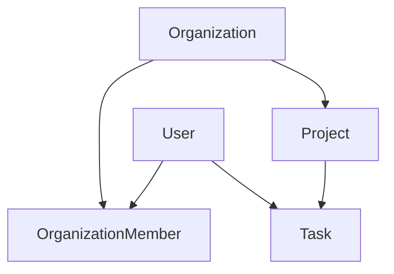
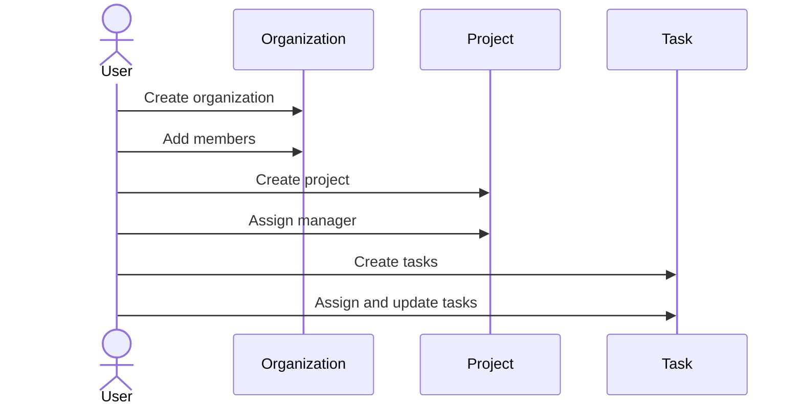

# WorkFlowX API

WorkFlowX is a Django REST API for managing organizations, projects, and tasks with role-based access and JWT authentication. It is designed for teams that need a simple, structured workflow: create an organization, add members, create projects, and track tasks.

## Project Idea

WorkFlowX is a role-based project and task management backend that feels like a smaller, cleaner Jira or Trello for teams. It focuses on core collaboration features while staying interview-ready and production-style.

## Problem Statement

Teams often struggle with:

- Tracking projects and tasks across different roles.
- Controlling who can view or modify sensitive data.
- Keeping audit trails and activity history.
- Scaling APIs with pagination, filtering, permissions, and performance.

Existing tools can be complex, expensive, or too heavy for small teams.

## Goal

Build a secure, scalable REST API that enables:

- Organizations to manage projects.
- Team members to manage tasks.
- Managers to control access.
- Admins to oversee everything.
- Clients (web/mobile) to consume clean, consistent APIs.

## Functionality Overview

- Users authenticate with JWT tokens.
- Organizations group users with roles: owner, manager, member.
- Projects belong to organizations and can have a manager.
- Tasks belong to projects and can be assigned to users.
- Access rules ensure only authorized users can create or modify data.

## Features

- JWT authentication with login and token refresh.
- Role-based permissions for organization, project, and task actions.
- Project manager assignment endpoint.
- Task filtering, search, and ordering.
- Health check endpoint.

## Data Model Summary

- User
- Organization
- OrganizationMember
- Project
- Task
- ActivityLog

## Relationship Diagram



## Workflow Diagram



## Endpoints (Root)

| Method | Path | Purpose |
|---|---|---|
| POST | /auth/login/ | JWT login |
| POST | /auth/refresh/ | Refresh access token |
| GET | /users/me/ | Current user info |
| GET | /organizations/ | List organizations |
| POST | /organizations/ | Create organization |
| GET | /organizations/{id}/ | Organization detail |
| PUT | /organizations/{id}/ | Update organization |
| PATCH | /organizations/{id}/ | Partial update organization |
| DELETE | /organizations/{id}/ | Delete organization |
| GET | /organizations/{organization_id}/members/ | List organization members |
| POST | /organizations/{organization_id}/members/ | Add organization member |
| GET | /projects/ | List projects |
| POST | /projects/ | Create project |
| GET | /projects/{id}/ | Project detail |
| PUT | /projects/{id}/ | Update project |
| PATCH | /projects/{id}/ | Partial update project |
| DELETE | /projects/{id}/ | Delete project |
| POST | /projects/{id}/assign_manager/ | Assign project manager |
| GET | /tasks/ | List tasks |
| POST | /tasks/ | Create task |
| GET | /tasks/{id}/ | Task detail |
| PUT | /tasks/{id}/ | Update task |
| PATCH | /tasks/{id}/ | Partial update task |
| DELETE | /tasks/{id}/ | Delete task |

## Endpoints (API v1)

| Method | Path | Purpose |
|---|---|---|
| GET | /api/v1/health/ | Health check |
| POST | /api/v1/auth/login/ | JWT login |
| POST | /api/v1/auth/refresh/ | Refresh access token |
| GET | /api/v1/users/me/ | Current user info |
| GET | /api/v1/organizations/ | List organizations |
| POST | /api/v1/organizations/ | Create organization |
| GET | /api/v1/organizations/{id}/ | Organization detail |
| PUT | /api/v1/organizations/{id}/ | Update organization |
| PATCH | /api/v1/organizations/{id}/ | Partial update organization |
| DELETE | /api/v1/organizations/{id}/ | Delete organization |
| GET | /api/v1/organizations/{organization_id}/members/ | List organization members |
| POST | /api/v1/organizations/{organization_id}/members/ | Add organization member |
| GET | /api/v1/projects/ | List projects |
| POST | /api/v1/projects/ | Create project |
| GET | /api/v1/projects/{id}/ | Project detail |
| PUT | /api/v1/projects/{id}/ | Update project |
| PATCH | /api/v1/projects/{id}/ | Partial update project |
| DELETE | /api/v1/projects/{id}/ | Delete project |
| POST | /api/v1/projects/{id}/assign_manager/ | Assign project manager |
| GET | /api/v1/tasks/ | List tasks |
| POST | /api/v1/tasks/ | Create task |
| GET | /api/v1/tasks/{id}/ | Task detail |
| PUT | /api/v1/tasks/{id}/ | Update task |
| PATCH | /api/v1/tasks/{id}/ | Partial update task |
| DELETE | /api/v1/tasks/{id}/ | Delete task |

## Task Filters and Search

Use query params on `GET /tasks/` and `GET /api/v1/tasks/`.

- Filter: `?status=todo&priority=high&assigned_to=3`
- Search: `?search=frontend`
- Ordering: `?ordering=due_date` or `?ordering=-created_at`

## Permissions Summary

- Owners and managers can create projects and tasks.
- Owners can assign project managers.
- Members can view tasks in their organization.
- Members can only modify tasks assigned to them.

## Role-Based Access Control

Roles are defined at the organization membership level:

- Owner: full control within the organization.
- Manager: can create projects and tasks, and manage team work.
- Member: can view org projects/tasks and update only their own assigned tasks.

Permission rules enforced by the API:

- Organizations: only members of an organization can view it.
- Organization members: only owners or managers can add members.
- Projects: only owners or managers can create; only owners can assign managers.
- Tasks: any active org member can view; owners/managers can modify all; members can modify only assigned tasks.

## Quick Start

1. Install dependencies in your environment.
2. Apply migrations with `python manage.py migrate`.
3. Run the server with `python manage.py runserver`.

## Testing

Run the full test suite:

```bash
python manage.py test
```

Run tests for a specific app:

```bash
python manage.py test accounts
python manage.py test organizations
python manage.py test projects
python manage.py test tasks
```

## Notes

- This project uses `accounts.User` as the custom user model.
- Both root endpoints and `/api/v1/` endpoints are enabled.
