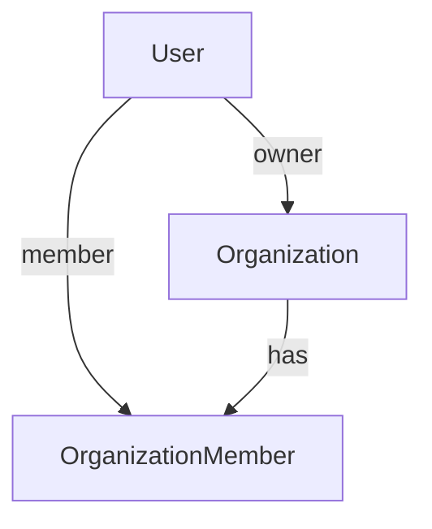

# Organizations App

## Purpose

Manages organizations and organization memberships with role-based access.

## Models

- Organization: name, owner, created_at
- OrganizationMember: user, organization, role (owner, manager, member), is_active

## Relationship Diagram

## Example Rows

User table:
- id: 1, email: `owner@acme.com`
- id: 2, email: `dev@acme.com`

Organization table:
- id: 10, name: `Acme`, owner_id: 1

OrganizationMember table:
- id: 100, user_id: 1, organization_id: 10, role: `owner`, is_active: true
- id: 101, user_id: 2, organization_id: 10, role: `member`, is_active: true

## Key Endpoints

- GET /organizations/ : List organizations
- POST /organizations/ : Create organization
- GET /organizations/{id}/ : Organization detail
- PUT/PATCH/DELETE /organizations/{id}/ : Update or delete organization
- GET /organizations/{organization_id}/members/ : List members
- POST /organizations/{organization_id}/members/ : Add member

## Permission Rules

- Only owners or managers can add members.
- Only active members can view organization data.

## File Overview

- `organizations/models.py`: Defines `Organization` and `OrganizationMember`.
- `organizations/serializers.py`: Serializers for orgs and members.
- `organizations/views.py`: ViewSets for orgs and org members.
- `organizations/urls.py`: Routes org and member endpoints.
- `organizations/admin.py`: Registers models for Django admin.
- `organizations/apps.py`: App configuration.
- `organizations/tests.py`: Test stubs for the app.
